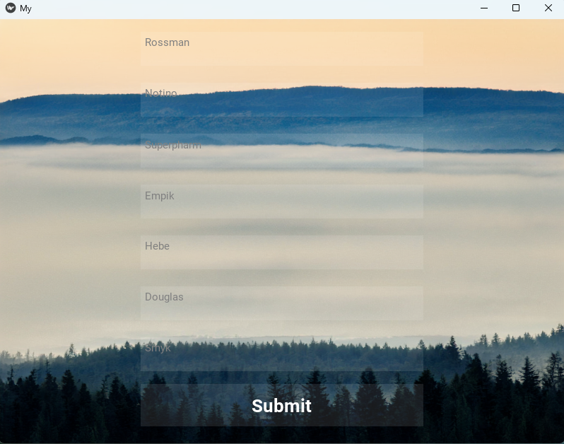
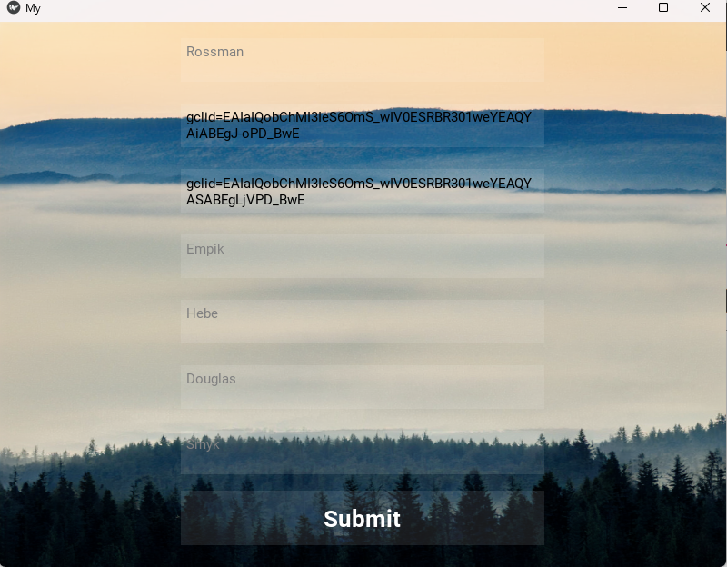
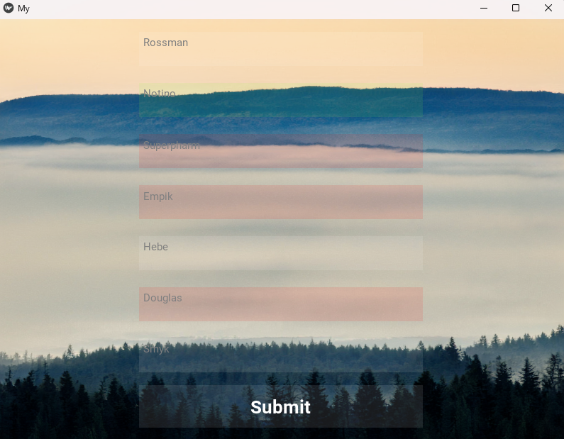

# Parfume_Prices_Tracker
This is a simple application designed to retrieve and store prices and data of men's fragrances from the most popular beauty retailer websites. The application scrapes individual web pages to extract information such as product names, capacities, and other relevant data.

---
# Table of contents
1. [How it works](#how-it-works)
2. [Example Input/Output](#example-inputoutput)
3. [Libraries Used](#libraries-used)
4. [Getting Started](#getting-started)
5. [Automating the process](#automating-the-process)
6. [TODO](#todo)
---
## How it works
First you need to create an Excel, where you want store of the collected data. Then the only thing you have to do is going the website of your favourite product and copy the link. After pasting it to the correct place in the app you just need to push the button.

---

## Example Input/Output
(Tu umieść przykład danych wejściowych i wyjściowych)

---
## Libraries Used
(Tu umieść informacje o użytych bibliotekach)

---
## Getting Started
(Tu umieść instrukcje dotyczące rozpoczęcia korzystania z aplikacji)

---
## Automating the process
(Tu umieść informacje dotyczące automatyzacji procesu)

---
## TODO

---
